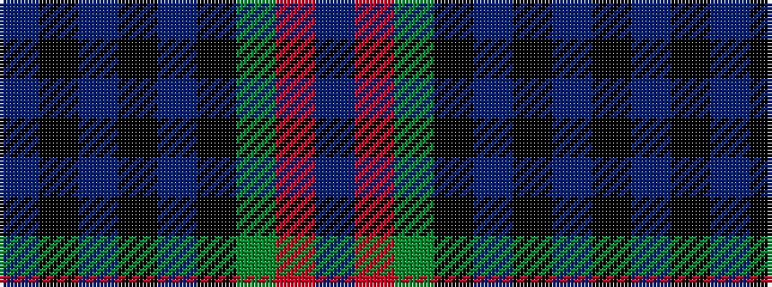

BKBKBKGRB

It is a 9 stripe tartan.

<figure class="pat-woven">

<figcaption>idealised sample</figcaption>
</figure>

## Colour Sequence



## Tartans with this colour sequence

| Tartans |
|---------------|
| [Damm, Alexander (Personal)](/variants/s9/db11k1db1k1db1k7dg8r1t7~x4/)|
||
