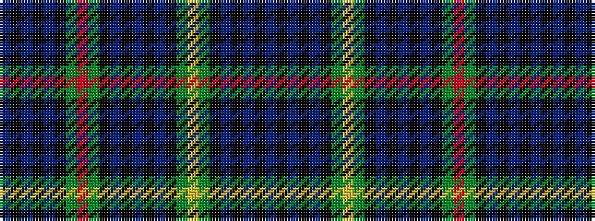

BKBKBKGRGKBKBKBKGYGKBKBKB

It is a 25 stripe tartan.

<figure class="pat-woven">

<figcaption>idealised sample</figcaption>
</figure>

## Colour Sequence



## Tartans with this colour sequence

| Tartans |
|---------------|
| [Farquharson](/setts/s25/db21k1db1k1db1k10g22r2g22k10db16k1db2k1db16k10g22ly2g22k10db1k1db1k1db7~x2/)|
||
