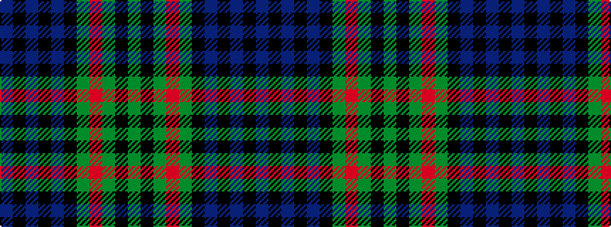

BKBKBKGRGKG

It is a 11 stripe tartan.

<figure class="pat-woven">

<figcaption>idealised sample</figcaption>
</figure>

## Colour Sequence



## Tartans with this colour sequence

This pattern is a design lineage: every tartan below shares one colour order, whatever its owner —
near-identical designs are grouped, the largest lineage first (#112: the pattern is a tartan's
second parent, beside its family or clan).

<table class="sett-table">
<tbody>
<tr><td><a href="/variants/s11/db24k4db4k4db4k24g24r5g6k2y2~x2/">Grant</a></td></tr>
<tr><td class="sett-swatch"></td></tr>
<tr><td><a href="/variants/s11/t22k4t4k4t4k22g22r5g6k2y3~x2/">Grant (Wilson's 1819 Key Pattern Book)</a></td></tr>
<tr><td class="sett-swatch"></td></tr>
<tr><td><a href="/variants/s11/db11k2db2k2db2k11g11r2g3k1y3~x2/">Grant Hunting Clan Tartan</a></td></tr>
<tr><td class="sett-swatch"></td></tr>
<tr><td><a href="/variants/s11/db22k4db4k4db4k22g22r6g6k2y3~x2/">MacLaren (labelled)</a></td></tr>
<tr><td class="sett-swatch"></td></tr>
</tbody>
</table>

