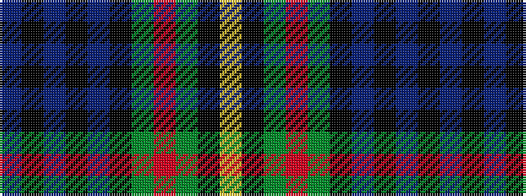

BKBKBKGRGKY

It is a 11 stripe tartan.

<figure class="pat-woven">

<figcaption>idealised sample</figcaption>
</figure>

## Colour Sequence



## Tartans with this colour sequence

| Tartans |
|---------------|
| [Grant](/setts/s11/db24k4db4k4db4k24g24r5g6k2ly2~x2/)|
||
| [Grant (Wilson's 1819 Key Pattern Book)](/setts/s11/b22k4b4k4b4k22g22r5g6k2ly3~x2/)|
||
| [Grant, hunting](/setts/s11/db11k2db2k2db2k11g11r2g3k1ly3~x2/)|
||
| [MacLaren](/setts/s11/db22k4db4k4db4k22g22r6g6k2ly3~x2/)|
||
| [MacLaren (labelled)](/setts/s11/db22k4db4k4db4k22dg22r6dg6k2ly3~x2/)|
||
