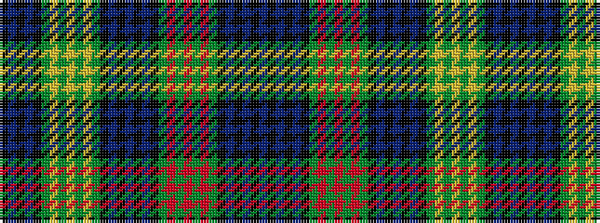

BKBKBKGRGRGRGKBKBKBKGYGYGYGKBKBK

It is a 32 stripe tartan.

<figure class="pat-woven">

<figcaption>idealised sample</figcaption>
</figure>

## Colour Sequence



## Tartans with this colour sequence

| Tartans |
|---------------|
| [Gordon #4](/variants/s32/db15k3db3k3db3k15dg15r1dg1r4dg1r1dg15k15db15k3db4k3db15k15dg15ly1dg1ly4dg1ly1dg15k15db3k3db3k3~x2/)|
||
| [Gordon 6](/variants/s32/db15k3db3k3db3k15g15r1g1r4g1r1g15k15db15k3db4k3db15k15g15ly1g1ly4g1ly1g15k15db3k3db3k3~x2/)|
||
