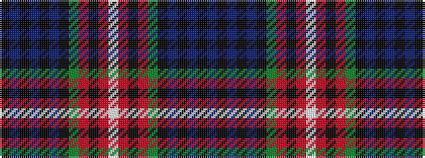

BKBKBKGRKRWRKRGKBKBKBK

It is a 22 stripe tartan.

<figure class="pat-woven">

<figcaption>idealised sample</figcaption>
</figure>

## Colour Sequence



## Tartans with this colour sequence

| Tartans |
|---------------|
| [Braveheart Warrior Corporate Tartan Tartan Number: 2231. Earliest known date: 1993 Designed by Michael King of Philip King Tailoring Ltd, Aberdeen. Originally designed for Ronnie Watt, an 8th Dan in martial arts representing Scotland whose ring title was Braveheart Warrior. It has been adopted as the official tartan of the Scottish Shotokan Centre and as the Watt tartan.The design has no direct connection with the Braveheart film. See products available Copyright © Blair Urquhart, Comrie, 2015](/setts/s22/k24db2k3dp1k1dp2k1dg5r2k1r2lb1~x4/)|
|![Braveheart Warrior Corporate Tartan Tartan Number: 2231. Earliest known date: 1993 Designed by Michael King of Philip King Tailoring Ltd, Aberdeen. Originally designed for Ronnie Watt, an 8th Dan in martial arts representing Scotland whose ring title was Braveheart Warrior. It has been adopted as the official tartan of the Scottish Shotokan Centre and as the Watt tartan.The design has no direct connection with the Braveheart film. See products available Copyright © Blair Urquhart, Comrie, 2015 example sett](/setts/s22/k24db2k3dp1k1dp2k1dg5r2k1r2lb1~x4/sett.png)|
| [Watt](/setts/s22/k96db8k12dp3k3dp3k3g20r8k3r4w4/)|
||
