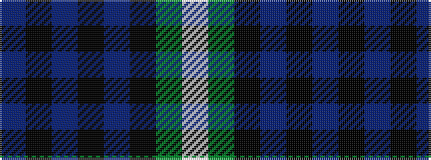

BKBKBKGW

It is a 8 stripe tartan.

<figure class="pat-woven">

<figcaption>idealised sample</figcaption>
</figure>

## Colour Sequence



## Tartans with this colour sequence

| Tartans |
|---------------|
| [Lamont](/setts/s8/db10k1db1k1db2k8g10w1~x2/)|
||
| [Lamont](/setts/s8/db10k1db1k1db2k8dg10w1~x4/)|
||
