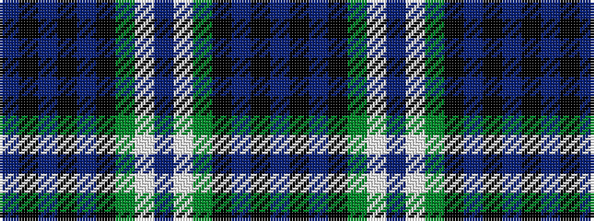

BKBKBKGWBWGKBKB

It is a 15 stripe tartan.

<figure class="pat-woven">

<figcaption>idealised sample</figcaption>
</figure>

## Colour Sequence



## Tartans with this colour sequence

| Tartans |
|---------------|
| [Lyon (Clan)](/setts/s15/b32k4b4k4b4k20g23w2b5w2g23k20b22k4b4/)|
||
