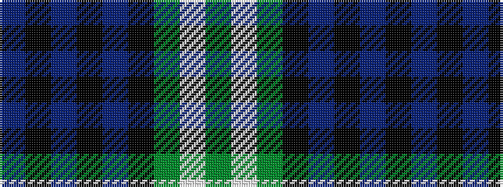

BKBKBKGWG

It is a 9 stripe tartan.

<figure class="pat-woven">

<figcaption>idealised sample</figcaption>
</figure>

## Colour Sequence



## Tartans with this colour sequence

| Tartans |
|---------------|
| [Abercrombie](/setts/s9/g14w1g7k7db2k2db2k2db7~x4/)|
||
| [Abercrombie](/setts/s9/dg14lb1dg7k7db2k2db2k2db7/)|
||
| [Abercrombie](/setts/s9/g14w1g7k7db2k2db2k2db7~x2/)|
||
| [Abercrombie](/setts/s9/db7k2db2k2db2k7g7w1g7~x4/)|
||
