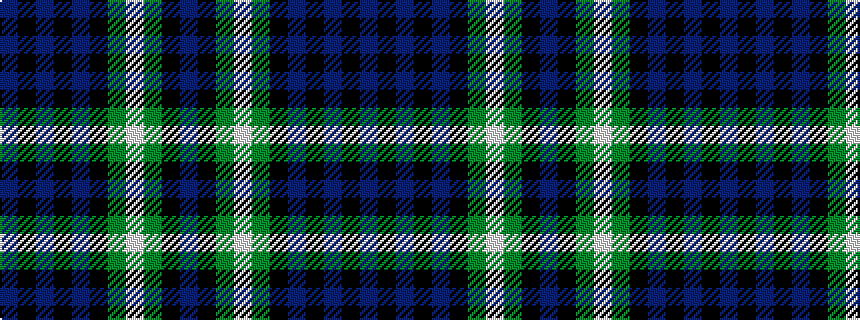

BKBKBKGWGKB

It is a 11 stripe tartan.

<figure class="pat-woven">

<figcaption>idealised sample</figcaption>
</figure>

## Colour Sequence



## Tartans with this colour sequence

| Tartans |
|---------------|
| [Dama Resort](/variants/s11/p3k2n6k2n2k18y13lb2y2k6p2~x2/)|
||
| [Dama Resort (Fashion)](/variants/s11/dp3k2n6k2n2k18g13lb2g2k6dp2~x2/)|
||
