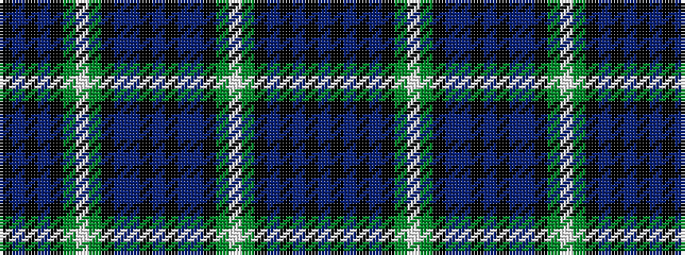

BKBKBKGWGKBBKBKBBKGWGKBKBK

It is a 26 stripe tartan.

<figure class="pat-woven">

<figcaption>idealised sample</figcaption>
</figure>

## Colour Sequence



## Tartans with this colour sequence

| Tartans |
|---------------|
| [Scottish Heritage Preservation](/setts/s26/dp22k2dp2k2dp2k18g8lb2g8k16dp15dp1k2dp2~x2/)|
||
