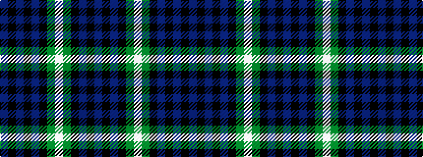

BKBKBKGWGKBKB

It is a 13 stripe tartan.

<figure class="pat-woven">

<figcaption>idealised sample</figcaption>
</figure>

## Colour Sequence



## Tartans with this colour sequence

| Tartans |
|---------------|
| [Lamont](/variants/s13/db3k1db1k1db1k4dg4lb1dg4k4db4k1db1/)|
||
| [Lamont](/variants/s13/db3k1db1k1db1k4g4w1g4k4db4k1db1~x2/)|
||
| [Lamont #3](/variants/s13/b23k3b3k3b3k22g22w3g22k22b18k3b3~x2/)|
||
| [Scottish Heritage Preservation (Corp](/variants/s13/dp11k1dp1k1dp1k9g4lb1g4k8dp8k1dp1~x4/)|
||
