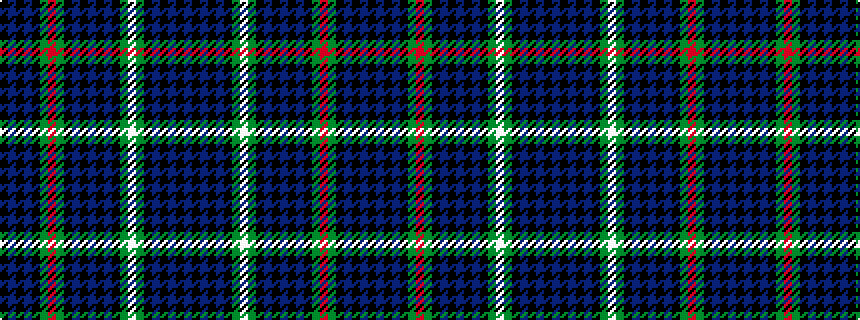

BKBKBKGWGKBKBKBKGRGKBKBK

It is a 24 stripe tartan.

<figure class="pat-woven">

<figcaption>idealised sample</figcaption>
</figure>

## Colour Sequence



## Tartans with this colour sequence

| Tartans |
|---------------|
| [MacKenzie (Vestiarium Scoticum)](/variants/s24/db18k2db2k2db2k6dg18w2dg18k6db18k1db4k1db18k6dg18r2dg18k6db2k2db2k2~x2/)|
||
