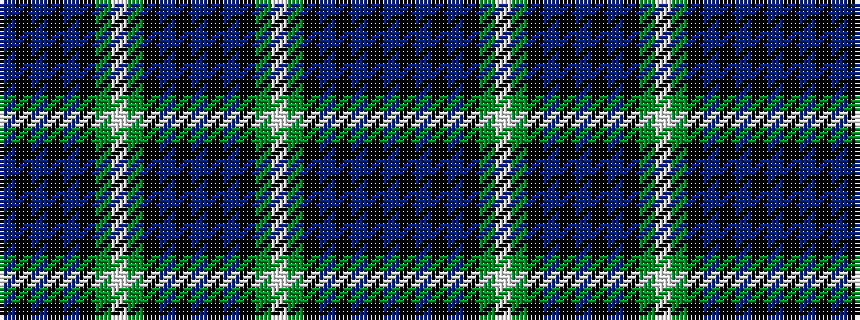

BKBKBKGWGKBKBKBKGWGKBKBKB

It is a 25 stripe tartan.

<figure class="pat-woven">

<figcaption>idealised sample</figcaption>
</figure>

## Colour Sequence



## Tartans with this colour sequence

| Tartans |
|---------------|
| [Lamont](/setts/s25/db9k3db3k3db3k12g12w3g12k12db12k3db3k3db12k12g12w3g12k12db3k3db3k3db5~x4/)|
||
