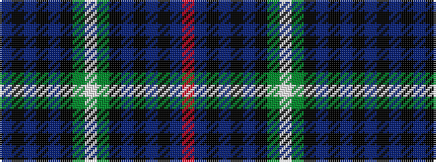

BKBKBKGWGKBKBKBR

It is a 16 stripe tartan.

<figure class="pat-woven">

<figcaption>idealised sample</figcaption>
</figure>

## Colour Sequence



## Tartans with this colour sequence

| Tartans |
|---------------|
| [Semple](/variants/s16/b11k3b3k3b4k15g36w3g36k15b4k3b3k3b11r4~x2/)|
||
