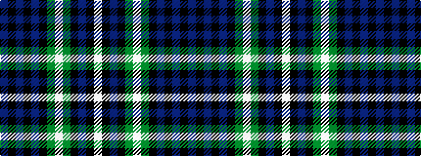

BKBKBKGWGKBKW

It is a 13 stripe tartan.

<figure class="pat-woven">

<figcaption>idealised sample</figcaption>
</figure>

## Colour Sequence



## Tartans with this colour sequence

| Tartans |
|---------------|
| [Cheape of Torosay (Personal)](/variants/s13/db8k1db1k1db1k7g6lb1g6k7db7k1lb1~x4/)|
||
