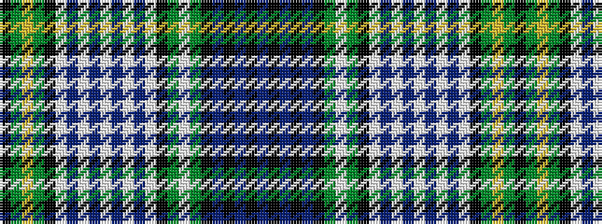

BKBKBKGWGKWBWBWBWBWKGYGK

It is a 24 stripe tartan.

<figure class="pat-woven">

<figcaption>idealised sample</figcaption>
</figure>

## Colour Sequence



## Tartans with this colour sequence

| Tartans |
|---------------|
| [Campbell Dress #2](/variants/s24/k12dg12ly3dg12k9w5b6w19b2w6b2w19b6w5k9dg12w3dg12k12db10k2db2k2db10~x2/)|
||
| [Campbell of Argyll Dress Clan Tartan](/variants/s24/k12g12ly3g12k9w5t6w19t2w6t2w19t6w5k9g12w3g12k12db10k2db2k2db10~x2/)|
||
| [Campbell, dress](/variants/s24/k12g12ly3g12k9w5b6w19b2w6b2w19b6w5k9g12w3g12k12db10k2db2k2db10~x2/)|
||
