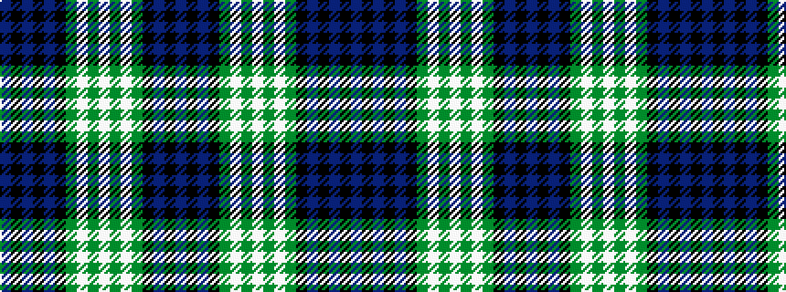

BKBKBKGWGWGWGKBKB

It is a 17 stripe tartan.

<figure class="pat-woven">

<figcaption>idealised sample</figcaption>
</figure>

## Colour Sequence



## Tartans with this colour sequence

| Tartans |
|---------------|
| [Baillie of Polkemmet](/tartans/db11k1db1k1db1k9g9w1g1w1g1w1g9k9db8k1db1/)|
||
