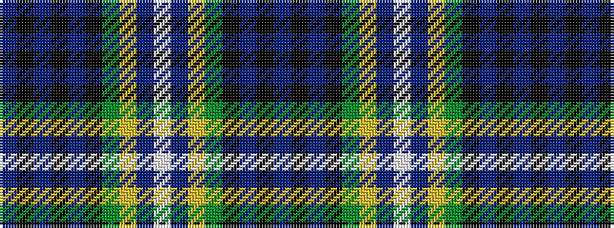

BKBKBKGYBWBYGKBKB

It is a 17 stripe tartan.

<figure class="pat-woven">

<figcaption>idealised sample</figcaption>
</figure>

## Colour Sequence



## Tartans with this colour sequence

| Tartans |
|---------------|
| [Polaris Corporate Tartan](/variants/s17/db6k1db1k1db1k7dg6ly1db1lb1db1ly1dg6k7db7k1db1~x4/)|
||
