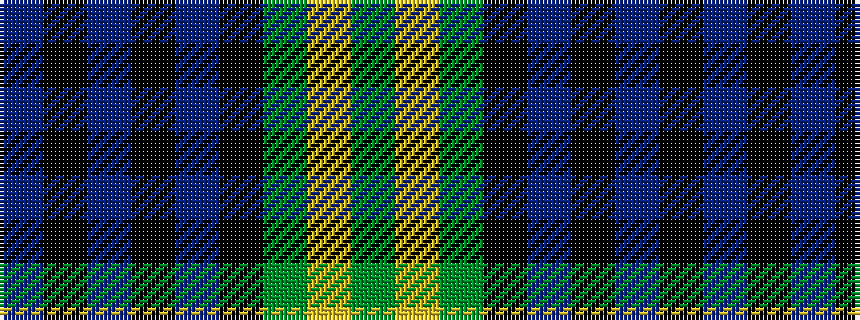

BKBKBKGYG

It is a 9 stripe tartan.

<figure class="pat-woven">

<figcaption>idealised sample</figcaption>
</figure>

## Colour Sequence



## Tartans with this colour sequence

| Tartans |
|---------------|
| [Abercrombie](/setts/s9/dg14lr1dg7k7db2k2db2k2db7~x2/)|
||
| [Abercrombie](/setts/s9/dg14lr1dg7k7db2k2db2k2db7/)|
||
| [Abercrombie D](/setts/s9/dg14lr1dg7k7db2k2db2k2db14~x2/)|
||
| [Abercrombie D](/setts/s9/dg14lr1dg7k7db2k2db2k2db14/)|
||
| [Christian Dewar (Personal)](/setts/s9/db16k2db2k2db2k6dg13ly2dg3~x2/)|
||
