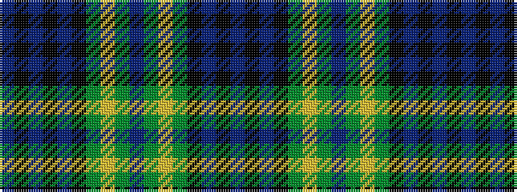

BKBKBKGYGBGYGKBKB

It is a 17 stripe tartan.

<figure class="pat-woven">

<figcaption>idealised sample</figcaption>
</figure>

## Colour Sequence



## Tartans with this colour sequence

| Tartans |
|---------------|
| [Arbuthnott](/setts/s17/db4k1db1k1db1k4dg2lr1dg2db2dg2lr1dg2k4db5k1db1~x2/)|
||
| [Arbuthnott](/setts/s17/db4k1db1k1db1k4dg2lr1dg2db2dg2lr1dg2k4db5k1db1/)|
||
| [Polaris](/setts/s17/db6k1db1k1db1k7g6ly1g1db1g1ly1g6k7db7k1db1~x4/)|
||
