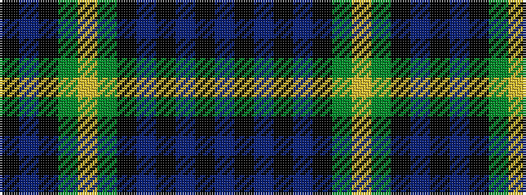

BKBKBKGYGKBK

It is a 12 stripe tartan.

<figure class="pat-woven">

<figcaption>idealised sample</figcaption>
</figure>

## Colour Sequence



## Tartans with this colour sequence

| Tartans |
|---------------|
| [Gordon](/setts/s12/db5k1db1k1db1k4dg5ly1dg5k4db6k1~x4/)|
||
| [Gordon 5](/setts/s12/db5k1db1k1db1k4g5ly1g5k4db6k1~x4/)|
||
