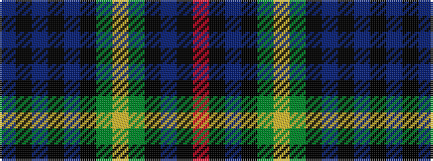

BKBKBKGYGKBKR

It is a 13 stripe tartan.

<figure class="pat-woven">

<figcaption>idealised sample</figcaption>
</figure>

## Colour Sequence



## Tartans with this colour sequence

| Tartans |
|---------------|
| [Loudoun's Highlanders - 1747 #2 (Mil](/variants/s13/db24k2db2k2db2k20dg20ly3dg20k20db24k2r4~x2/)|
||
| [MacLeod of Gesto](/variants/s13/db9k1db1k1db1k7dg8ly2dg8k7db8k1r2~x2/)|
||
| [MacLeod of Gesto](/variants/s13/db9k1db1k1db1k7g8ly2g8k7db8k1r2~x2/)|
||
