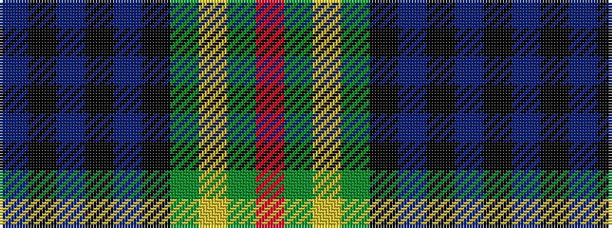

BKBKBKGYGR

It is a 10 stripe tartan.

<figure class="pat-woven">

<figcaption>idealised sample</figcaption>
</figure>

## Colour Sequence



## Tartans with this colour sequence

| Tartans |
|---------------|
| [Barnes](/variants/s10/db20k3db3k3db3k16g2ly3g12r2~x2/)|
||
| [Barnes Hunting (Personal)](/variants/s10/db20k3db3k3db3k16g3lo3g12r2~x2/)|
||
