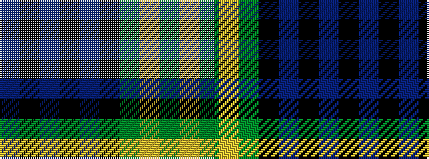

BKBKBKGYGY

It is a 10 stripe tartan.

<figure class="pat-woven">

<figcaption>idealised sample</figcaption>
</figure>

## Colour Sequence



## Tartans with this colour sequence

| Tartans |
|---------------|
| [Gordon #2](/variants/s10/db56k6db6k6db6k44dg44ly4dg5ly8/)|
||
| [Gordon 3](/variants/s10/db56k6db6k6db6k44g44ly4g5ly8/)|
||
