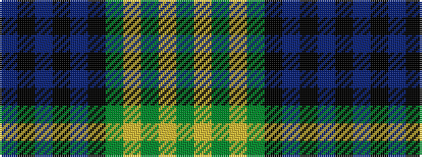

BKBKBKGYGYG

It is a 11 stripe tartan.

<figure class="pat-woven">

<figcaption>idealised sample</figcaption>
</figure>

## Colour Sequence



## Tartans with this colour sequence

| Tartans |
|---------------|
| [Hunting, The](/setts/s11/g24ly3g4ly1g17k25t2k2t2k2t22~x2/)|
||
