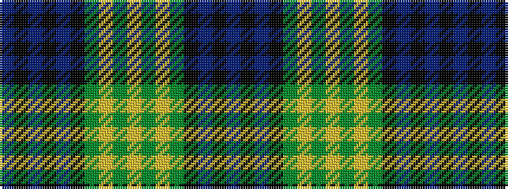

BKBKBKGYGYGYGKBKB

It is a 17 stripe tartan.

<figure class="pat-woven">

<figcaption>idealised sample</figcaption>
</figure>

## Colour Sequence



## Tartans with this colour sequence

| Tartans |
|---------------|
| [Gordon VS](/tartans/db28k1db1k1db3k12dg24ly1dg1ly2dg1ly1dg24k12db18k1db4/)|
||
| [Gordon of Esselmont (Clan)](/setts/s17/db15k2db2k2db2k14g14ly2g2ly4g2ly2g14k14db14k2db2~x2/)|
||
| [Gordon, Ancient](/setts/s17/db28k1db1k1db3k12g24ly1g1ly2g1ly1g24k12db18k1db4~x2/)|
||
