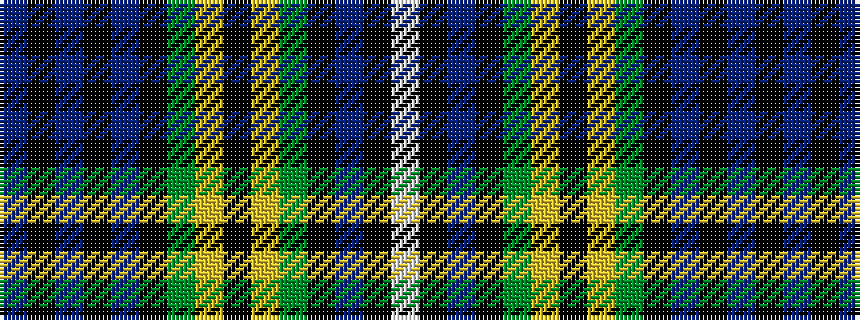

BKBKBKGYKYGKBKW

It is a 15 stripe tartan.

<figure class="pat-woven">

<figcaption>idealised sample</figcaption>
</figure>

## Colour Sequence



## Tartans with this colour sequence

| Tartans |
|---------------|
| [Dyce](/setts/s15/db16k2db2k2db2k12g12ly2k2ly2g12k16db16k1w3~x2/)|
||
| [Dyce #2](/setts/s15/db16k2db2k2db2k12dg12ly2k2ly2dg12k16db16k1w3~x2/)|
||
