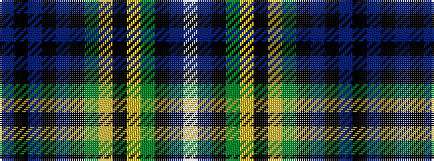

BKBKBKGYKYGKBW

It is a 14 stripe tartan.

<figure class="pat-woven">

<figcaption>idealised sample</figcaption>
</figure>

## Colour Sequence



## Tartans with this colour sequence

| Tartans |
|---------------|
| [Dyce](/variants/s14/b9k1b1k1b1k8g8ly1k1ly1g8k8b8w1~x4/)|
||
| [Dyce](/variants/s14/db9k1db1k1db1k8g8ly1k1ly1g8k8db8w1~x2/)|
||
