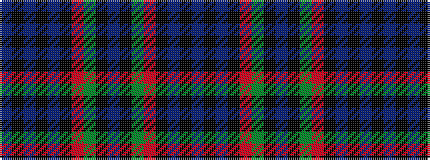

BKBKBKRGKBKGRKBKB

It is a 17 stripe tartan.

<figure class="pat-woven">

<figcaption>idealised sample</figcaption>
</figure>

## Colour Sequence



## Tartans with this colour sequence

| Tartans |
|---------------|
| [Sempill](/setts/s17/db22k3db3k3db3k15r2g19k1t3k1g19r2k15db19k3db3~x2/)|
||
