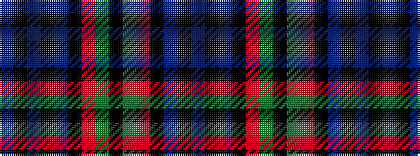

BKBKBKRGKGRKBKB

It is a 15 stripe tartan.

<figure class="pat-woven">

<figcaption>idealised sample</figcaption>
</figure>

## Colour Sequence



## Tartans with this colour sequence

| Tartans |
|---------------|
| [Fletcher](/setts/s15/db11k3db3k3db3k11r3g13k3g13r3k11db11k3db3~x2/)|
||
| [Fletcher](/setts/s15/db11k3db3k3db3k11r3dg13k3dg13r3k11db11k3db3~x2/)|
||
