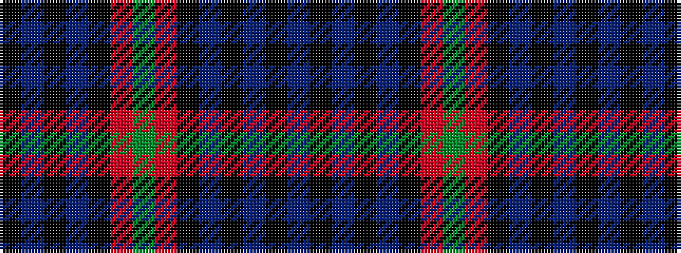

BKBKBKRGRKBKBK

It is a 14 stripe tartan.

<figure class="pat-woven">

<figcaption>idealised sample</figcaption>
</figure>

## Colour Sequence



## Tartans with this colour sequence

| Tartans |
|---------------|
| [Riddoch Personal Tartan](/variants/s14/g28r2k15db2k2db2k2db18~x2/)|
||
