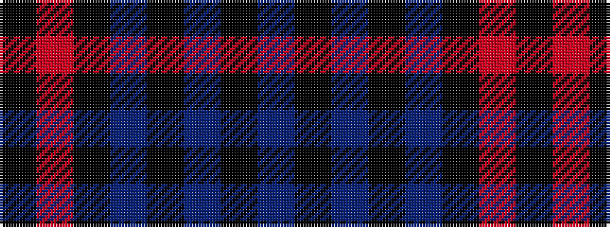

BKBKBKRK

It is a 8 stripe tartan.

<figure class="pat-woven">

<figcaption>idealised sample</figcaption>
</figure>

## Colour Sequence



## Tartans with this colour sequence

| Tartans |
|---------------|
| [Speyside Blue (Fashion)](/setts/s8/n32k3n3k3b5k8o21k4~x2/)|
||
