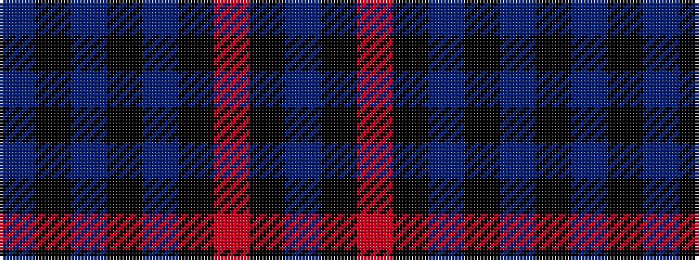

BKBKBKRKB

It is a 9 stripe tartan.

<figure class="pat-woven">

<figcaption>idealised sample</figcaption>
</figure>

## Colour Sequence



## Tartans with this colour sequence

| Tartans |
|---------------|
| [Trotter (Personal)](/setts/s9/dt23k2dt2k2dt2k28r2k4n2~x2/)|
||
