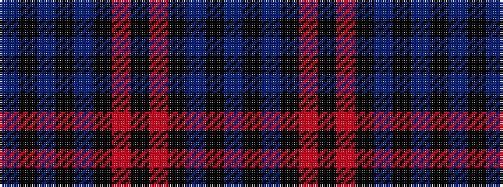

BKBKBKRKRKBKB

It is a 13 stripe tartan.

<figure class="pat-woven">

<figcaption>idealised sample</figcaption>
</figure>

## Colour Sequence



## Tartans with this colour sequence

| Tartans |
|---------------|
| [MacDevitt (Name)](/setts/s13/db12k2db2k2db2k10r12k3r12k10db12k2db2~x2/)|
||
| [Wine Watch (Fashion)](/setts/s13/db11k1db1k1db1k8m8k1m8k8db8k1db1~x4/)|
||
