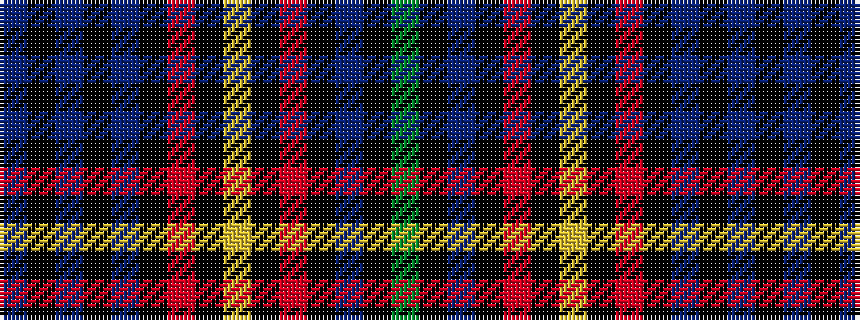

BKBKBKRKYKRKBKG

It is a 15 stripe tartan.

<figure class="pat-woven">

<figcaption>idealised sample</figcaption>
</figure>

## Colour Sequence



## Tartans with this colour sequence

| Tartans |
|---------------|
| [Dryer (Personal)](/variants/s15/db9k1db1k1db1k7r8k1ly3k1r8k7db8k1g3~x4/)|
||
