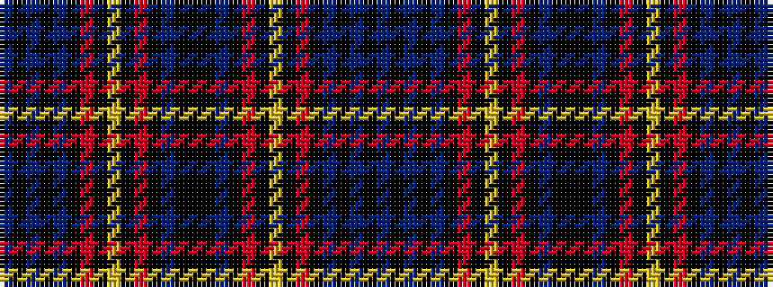

BKBKBKRKYKRKBKKKBKRKYKRKBKBKB

It is a 29 stripe tartan.

<figure class="pat-woven">

<figcaption>idealised sample</figcaption>
</figure>

## Colour Sequence



## Tartans with this colour sequence

| Tartans |
|---------------|
| [Dryer](/setts/s29/db15ki1db1ki1db1ki7r8ki1ly3ki1r8ki7db8ki1k3ki1db8ki7r8ki1ly3ki1r8ki7db1ki1db1ki1db9~x4/)|
||
