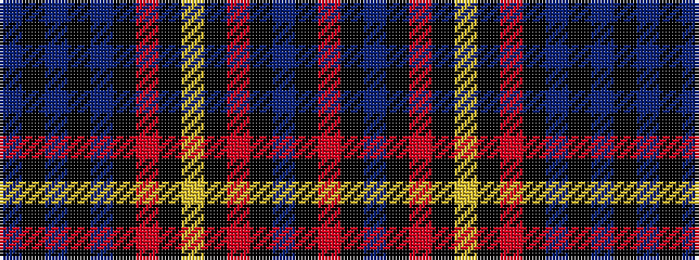

BKBKBKRKYKRKBKR

It is a 15 stripe tartan.

<figure class="pat-woven">

<figcaption>idealised sample</figcaption>
</figure>

## Colour Sequence



## Tartans with this colour sequence

| Tartans |
|---------------|
| [Flaumandrum](/variants/s15/n12k2n2k2n2k12ri12k1ly2k1ri12k12n12k1r2~x2/)|
||
