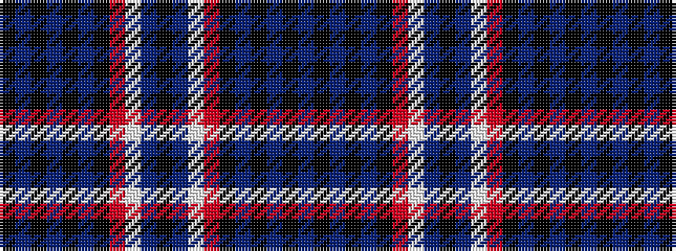

BKBKBKRWBKBWRKBKBKBK

It is a 20 stripe tartan.

<figure class="pat-woven">

<figcaption>idealised sample</figcaption>
</figure>

## Colour Sequence



## Tartans with this colour sequence

| Tartans |
|---------------|
| [Westenra of Christchurch](/setts/s20/k20dt4k8db9k8dt14k8r3w3db10k12~x2/)|
||
