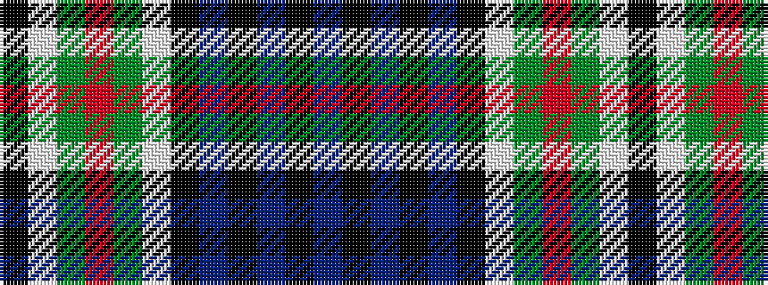

BKBKBKWGRGWK

It is a 12 stripe tartan.

<figure class="pat-woven">

<figcaption>idealised sample</figcaption>
</figure>

## Colour Sequence



## Tartans with this colour sequence

| Tartans |
|---------------|
| [Fruin Colquhoun](/setts/s12/k19w3g19r5g19w3k19db19k3db2k3db19~x2/)|
||
