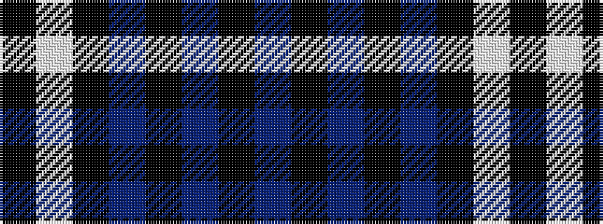

BKBKBKWK

It is a 8 stripe tartan.

<figure class="pat-woven">

<figcaption>idealised sample</figcaption>
</figure>

## Colour Sequence



## Tartans with this colour sequence

| Tartans |
|---------------|
| [Laksaa (Manx)](/setts/s8/n22k2n2k2n2k16w16k3~x2/)|
||
