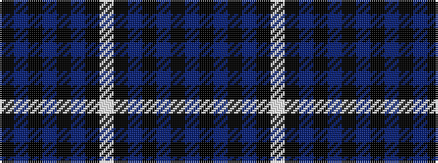

BKBKBKWKBKBKBK

It is a 14 stripe tartan.

<figure class="pat-woven">

<figcaption>idealised sample</figcaption>
</figure>

## Colour Sequence



## Tartans with this colour sequence

| Tartans |
|---------------|
| [Slanj Dress](/variants/s14/db36k4db4k34b3k3w4k3b3k34db4k4db36k4~x2/)|
||
