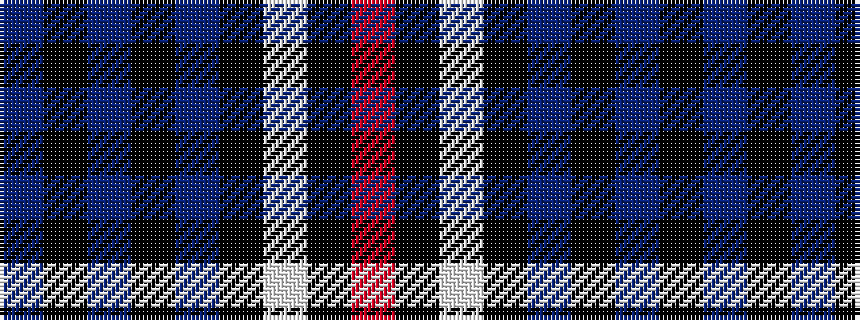

BKBKBKWKR

It is a 9 stripe tartan.

<figure class="pat-woven">

<figcaption>idealised sample</figcaption>
</figure>

## Colour Sequence



## Tartans with this colour sequence

| Tartans |
|---------------|
| [Llewellen of Wales](/variants/s9/dr74k4dr7k4dr9k40w2k4o2/)|
||
