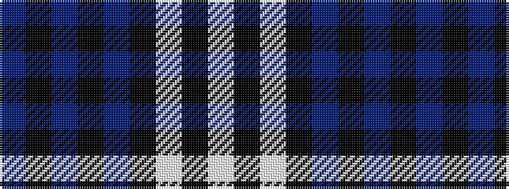

BKBKBKWKW

It is a 9 stripe tartan.

<figure class="pat-woven">

<figcaption>idealised sample</figcaption>
</figure>

## Colour Sequence



## Tartans with this colour sequence

| Tartans |
|---------------|
| [Nocken (Personal)](/setts/s9/lb3k6lb2k6db2k2db32k2n1~x2/)|
||
