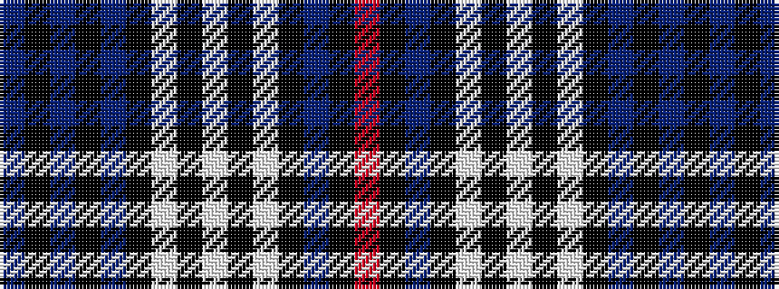

BKBKBKWKWKWKBKR

It is a 15 stripe tartan.

<figure class="pat-woven">

<figcaption>idealised sample</figcaption>
</figure>

## Colour Sequence



## Tartans with this colour sequence

| Tartans |
|---------------|
| [MacKenzie Blue](/setts/s15/db6k1db1k1db1k6lt6k1w1k1lt6k6db6k1r1~x4/)|
||
