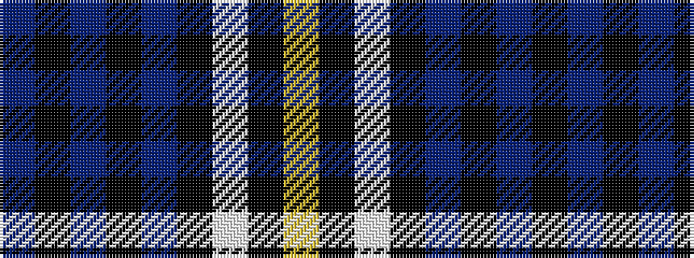

BKBKBKWKY

It is a 9 stripe tartan.

<figure class="pat-woven">

<figcaption>idealised sample</figcaption>
</figure>

## Colour Sequence



## Tartans with this colour sequence

| Tartans |
|---------------|
| [Nocken Blue Modern Tartan (Personal)](/variants/s9/lr3k6w2k6dt2k2dt32k2n1~x2/)|
||
