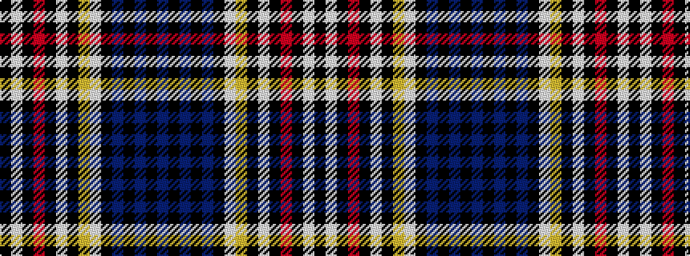

BKBKBKWYKWKRKWK

It is a 15 stripe tartan.

<figure class="pat-woven">

<figcaption>idealised sample</figcaption>
</figure>

## Colour Sequence



## Tartans with this colour sequence

| Tartans |
|---------------|
| [Unidentified Fashion](/variants/s15/n32k4n5k4n32k2w2lo12k16w8k4r5k4w8k16~x2/)|
||
