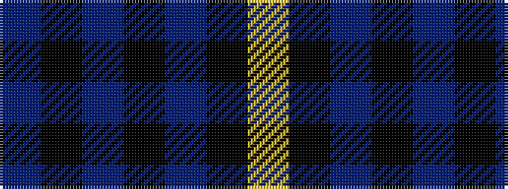

BKBKBKY

It is a 7 stripe tartan.

<figure class="pat-woven">

<figcaption>idealised sample</figcaption>
</figure>

## Colour Sequence



## Tartans with this colour sequence

| Tartans |
|---------------|
| [Tartan Army Children's Charity (Corp](/setts/s7/n34k7n12k39n3k4lg3~x2/)|
||
