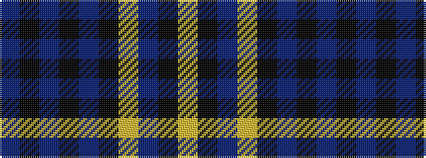

BKBKBKYBKY

It is a 10 stripe tartan.

<figure class="pat-woven">

<figcaption>idealised sample</figcaption>
</figure>

## Colour Sequence



## Tartans with this colour sequence

| Tartans |
|---------------|
| [Pride of Scotland, Muted (Fashion)](/setts/s10/do8k2do2k14do2k2ly1do19k27ly2~x2/)|
||
