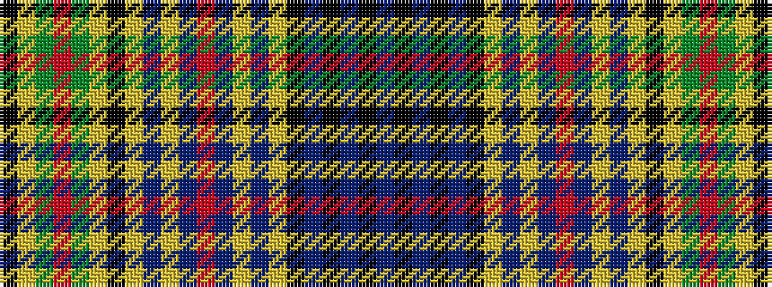

BKBKBKYBYBRBYBYKYGRGYK

It is a 22 stripe tartan.

<figure class="pat-woven">

<figcaption>idealised sample</figcaption>
</figure>

## Colour Sequence



## Tartans with this colour sequence

| Tartans |
|---------------|
| [Colquhoun Dress](/variants/s22/k15lr2g14r2g14lr2k15lr3db3lr19db2r2db2lr18db3lr3k15db10k2db2k2db10~x2/)|
||
